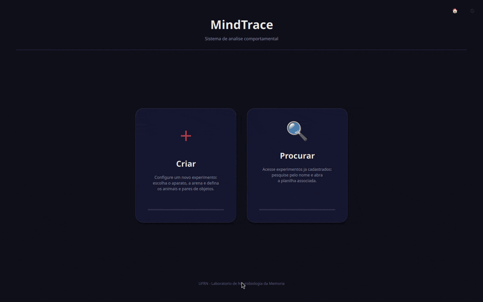
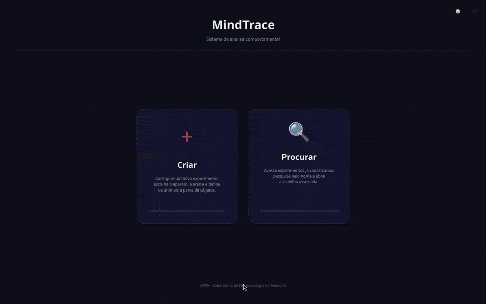

# MindTrace — MemoryLab / UFRN

Sistema de tracking comportamental de ratos para paradigmas **NOR**, **Campo Aberto**, **Comportamento Complexo** e **Esquiva Inibitória**, rodando nativamente em C++ com ONNX Runtime.

> **Sistema operacional:** Windows 10 ou 11 (64-bit) obrigatório

<p align="center">
  
  <br>
  <sub>Interface: criação de um experimento NOR, abas Arena, Gravação e Dados, tema escuro e claro.</sub>
</p>

<p align="center">
  
  <br>
  <sub>Esquiva Inibitória: vídeo carregado, plataforma, grade e paredes alinhadas ao chão no Dev Mode e tracking de focinho e corpo com tempo em cada zona.</sub>
</p>

---

## 📚 Documentação (Centralizada em `/docs`)

**Novo no projeto? Comece aqui:**

| Link | Público |
|------|---------|
| **[docs/QUICK_START.md](docs/QUICK_START.md)** | 📍 Escolha seu caminho em 2 minutos |
| **[docs/GLOSSÁRIO.md](docs/GLOSSÁRIO.md)** | 📚 Termos técnicos explicados |
| **[README.md (abaixo)](https://github.com/RodrigoOrvate/MindTrace)** | 🔧 Documentação técnica |

---

## Escolha como deseja usar o MindTrace

| Quero usar o programa | Quero modificar o código |
|---|---|
| [→ Instalação via Setup](#instalação-via-setup-para-usuários) | [→ Instalação para Desenvolvimento](#instalação-para-desenvolvimento) |

---

## Instalação via Setup (para usuários)

> ⚠️ **Ainda não há instalador publicado.** Enquanto a primeira versão não sai em [Releases](https://github.com/RodrigoOrvate/MindTrace/releases), use a [Instalação para Desenvolvimento](#instalação-para-desenvolvimento) ou gere o instalador você mesmo ([Gerar o instalador](#gerar-o-instalador)).

O instalador já traz o executável, as bibliotecas do Qt, o ONNX Runtime com DirectML e o modelo de pose. Dois recursos opcionais dependem de programas instalados à parte:

| Recurso | Precisa de | Sem ele |
|---|---|---|
| Exportação formatada em `.xlsx` (aba Dados → **Exportar**) | [Python 3](https://www.python.org/downloads/) com **"Add Python to PATH"** marcado | A exportação gera apenas o `.csv` |
| Clipes de vídeo por cluster (B-SOiD, Comportamento Complexo) | `ffmpeg.exe` na pasta do MindTrace ou no PATH | É gerado apenas um `timestamps.csv` por cluster |

### Passo 1 — Baixar o instalador

Acesse a página de [Releases do repositório](https://github.com/RodrigoOrvate/MindTrace/releases) e baixe o arquivo `MindTrace_Setup_<versão>.exe` mais recente (ex.: `MindTrace_Setup_1.0.0.exe`).

### Passo 2 — Executar o instalador

Dê duplo clique no arquivo baixado (é preciso permissão de administrador) e siga as instruções:

1. Escolha a pasta de instalação (padrão: `C:\Program Files\MindTrace`)
2. Se quiser, marque **Criar atalho na Área de Trabalho**
3. Clique em **Instalar**
4. Ao final, deixe marcada a opção **Iniciar MindTrace agora** e clique em **Concluir**

O atalho no Menu Iniciar é criado sempre; o da Área de Trabalho, só se a opção for marcada.

### Passo 3 — Modelo ONNX

O modelo de pose (`Network-MemoryLab-v2.onnx`) já está incluído no instalador — nenhuma ação é necessária.

**Para trocar o modelo:** substitua o arquivo `.onnx` na pasta de instalação (ex: `C:\Program Files\MindTrace\`) pelo novo modelo. O nome não importa: o app carrega o primeiro `.onnx` (em ordem alfabética) da pasta do executável, por isso deixe apenas um. Se não houver nenhum ali, ele procura em `Documentos\MindTrace_Data\DLC_Model\`.

### Desinstalar

Vá em **Configurações do Windows → Aplicativos → MindTrace → Desinstalar**, ou use o atalho **Desinstalar MindTrace** no Menu Iniciar.

---

## Instalação para Desenvolvimento

Para quem quer modificar o código, testar alterações e compilar o projeto.

### 1. Instalar o GitHub Desktop e clonar o repositório

Baixe o **GitHub Desktop** em [desktop.github.com](https://desktop.github.com/) e instale normalmente.

Após instalar:
1. Clique em **File → Clone repository**
2. Vá na aba **URL** e cole: `https://github.com/RodrigoOrvate/MindTrace`
3. Escolha onde salvar (ex: `C:\MindTrace`) e clique em **Clone**

---

### 2. Instalar os programas necessários

Instale os programas abaixo **nesta ordem**.

---

#### Python 3.12.10
**Download:** [python.org/downloads/release/python-31210](https://www.python.org/downloads/release/python-31210/)

Na instalação:
- ✅ Marque **"Add Python to PATH"** (opção no rodapé da tela inicial — obrigatório)
- Clique em **Install Now**

> Usado pelo script `formatar_mindtrace.py`, que o MindTrace chama ao **Exportar** para gerar o `.xlsx` formatado. O script só usa a biblioteca padrão do Python — não é preciso instalar pacotes.

---

#### Visual Studio Community
**Download:** [visualstudio.microsoft.com/vs/community](https://visualstudio.microsoft.com/vs/community/)

Na tela de workloads, marque:
- ✅ **"Desenvolvimento para desktop com C++"**

Com esse workload selecionado, confirme que os seguintes componentes estão marcados na coluna de detalhes à direita:

| Componente | Obrigatório |
|---|---|
| Ferramentas de build do MSVC — C++ x64/x86 (versão mais recente) | ✅ Sim |
| Windows 11 SDK (10.0.26100 ou mais recente) | ✅ Sim |
| CMake C++ para Windows | ✅ Sim |

Deixe os demais como padrão e clique em **Instalar**.

> O `build.bat` detecta automaticamente o Visual Studio — não é necessário configurar nada manualmente após instalar.

---

#### Visual Studio Code *(recomendado)*
**Download:** [code.visualstudio.com](https://code.visualstudio.com/)

Instalação padrão. Abra a pasta `C:\MindTrace` no VSCode para editar e acompanhar o build com syntax highlighting e IntelliSense.

---

#### Qt 6.11.0
**Download:** [qt.io/download-open-source](https://www.qt.io/download-open-source)

Crie uma conta Qt gratuita se ainda não tiver, baixe o **Qt Online Installer** e execute.

Na tela de seleção de componentes, expanda **Qt → Qt 6.11.0** e marque **apenas**:

| Componente | Obrigatório |
|---|---|
| **MSVC 2022 64-bit** | ✅ Sim — compilador usado pelo MindTrace |
| Qt Multimedia | ✅ Sim — pipeline de vídeo |
| Qt Shader Tools | ✅ Sim — renderização de vídeo |

Deixe todos os outros componentes **desmarcados**.

Certifique-se de que o Qt será instalado em `C:\Qt\6.11.0\msvc2022_64\`.  
Se escolher outro caminho, edite a variável `QT_DIR` no início do arquivo `qt\scripts\build.bat`.

---

#### CMake 3.25+
**Download:** [cmake.org/download](https://cmake.org/download/)

Baixe o instalador `.msi` para Windows x64. Durante a instalação:
- ✅ Marque **"Add CMake to the system PATH for all users"**

---

### 3. Modelo ONNX

O modelo de pose (`qt\Network-MemoryLab-v2.onnx`) já vem no repositório e o `build.bat` o copia para `build\Release\` — nenhuma ação é necessária.

Para testar outro modelo, substitua esse arquivo (ou o de `build\Release\`). O app carrega o primeiro `.onnx` em ordem alfabética da pasta do executável, então mantenha apenas um.

---

### 4. Executar o build

Na primeira vez, navegue até `qt\scripts\` e dê duplo clique em **`build.bat`**.

O que acontece automaticamente:
1. Detecta o Visual Studio instalado (2022 ou 2026)
2. Verifica o ONNX Runtime SDK — se ausente, pergunta e baixa automaticamente (veja [Sobre o ONNX Runtime](#sobre-o-onnx-runtime))
3. Configura e compila o projeto com CMake/MSBuild em paralelo
4. Copia as DLLs do Qt (`windeployqt`) e do ONNX Runtime, o modelo `.onnx` e o `formatar_mindtrace.py`
5. Abre o `MindTrace.exe`

> **Na primeira execução** a compilação demora alguns minutos. Nas próximas, apenas os arquivos alterados são recompilados — muito mais rápido.

Opções de linha de comando do `build.bat`:

| Comando | Efeito |
|---|---|
| `build.bat --gpu DML` / `build.bat --gpu CUDA` | Escolhe o pacote do ONNX Runtime sem perguntar |
| `build.bat --deps-only` | Só baixa/configura o ONNX Runtime, sem compilar |

Para abrir sem recompilar: use `qt\scripts\run.bat`.

---

### Localização dos arquivos gerados

| Arquivo | Caminho |
|---|---|
| Executável | `build\Release\MindTrace.exe` |
| Log do app | `build\Release\mindtrace.log` |
| Instalador (após `build_installer.bat`) | `installer\MindTrace_Setup_<versão>.exe` |

---

### Gerar o instalador

1. Rode o `build.bat` com o pacote **DirectML** (opção `[1]` ou `--gpu DML`) — o instalador empacota as DLLs do DirectML.
2. Instale o [Inno Setup 6](https://jrsoftware.org/isdl.php).
3. Execute `qt\scripts\build_installer.bat`.

O arquivo é gerado em `installer\MindTrace_Setup_<versão>.exe`. A versão fica em `AppVersion`, no início de `qt\scripts\installer.iss`.

---

## Sobre o ONNX Runtime

Configurado **automaticamente** pelo `build.bat` na primeira execução (versão 1.24.4). Se o SDK estiver ausente, o script pergunta qual pacote baixar:

```
[1] DML (AMD/Intel/CPU) - recommended
[2] CUDA (NVIDIA)
[3] Cancel
```

O pacote DML vem do NuGet (ONNX Runtime + DirectML) e o CUDA, das releases oficiais do ONNX Runtime. Ambos são extraídos em `onnxruntime_sdk\`.

### Detecção de GPU em Runtime

| GPU detectada | Ordem de tentativa |
|---|---|
| NVIDIA | CUDA → DirectML → CPU |
| AMD / Intel | DirectML → CPU |
| Nenhuma | CPU |

Fallback automático — sem necessidade de recompilar. Cada provedor só está disponível se o pacote correspondente foi instalado: o build CUDA não inclui DirectML e o instalador (build DML) não inclui CUDA, então em placas NVIDIA a versão do instalador usa DirectML.

> **Sem GPU o tracking fica bem mais lento.** A análise continua funcionando na CPU, mas pode processar poucos quadros por segundo — nesse caso os marcadores ficam para trás do animal.

---

## Arquitetura do Sistema

```
MindTrace.exe (Qt 6.11.0 / C++17 / ONNX Runtime 1.24.4)
  └── LiveRecording.qml
        └── InferenceController (C++)
             ├── QVideoSink  → videoFrameChanged → enqueueFrame
             └── InferenceEngine (QThread)
                  ├── DXGI vendor detection → CUDA / DirectML / CPU
                  ├── BehaviorScanner[3]   21 features + classifySimple()
                  └── 3× Ort::Session (Pose DLC) — paralelo por campo

  └── CCDashboard
        └── BSoidAnalyzer (C++ QObject)
             ├── BSoidWorker (QThread)  PCA 21→6 + K-Means++ k=7
             ├── populateTimelines()   BehaviorTimeline via SceneGraph (GPU)
             └── extractSnippets()    QProcess (FFmpeg) → clips por cluster
```

---

## Estrutura de Pastas

```
MindTrace/
├── build/                       Saída do build (gerada automaticamente)
│   └── Release/
│       ├── MindTrace.exe
│       └── mindtrace.log
├── installer/                   Instalador gerado por build_installer.bat
├── onnxruntime_sdk/             SDK ONNX Runtime (configurado pelo build.bat)
├── docs/                        QUICK_START, GLOSSÁRIO e as prévias do README
└── qt/
    ├── src/
    │   ├── core/                main.cpp
    │   ├── manager/             ExperimentManager (experimentos, sessões, sincronização)
    │   ├── models/              ExperimentTableModel, ArenaModel, ArenaConfigModel
    │   ├── tracking/            InferenceController, InferenceEngine, BehaviorScanner,
    │   │                        BehaviorTimeline, captura DirectShow
    │   ├── analysis/            BSoidAnalyzer
    │   └── settings/            ThemeSettings, LanguageSettings
    ├── qml/
    │   ├── core/                Navegação e componentes base (main.qml, Theme/)
    │   ├── shared/              LiveRecording.qml, DataView.qml, BoutEditorPanel.qml
    │   ├── nor/                 NOR Dashboard e Setup
    │   ├── ca/                  Campo Aberto Dashboard e Setup
    │   ├── cc/                  Comportamento Complexo Dashboard e Setup
    │   └── ei/                  Esquiva Inibitória Dashboard e Setup
    ├── data/                    Arenas de referência (arenas.json, arena_config_*.json)
    ├── scripts/                 build.bat, run.bat, setup_onnx.ps1,
    │                            build_installer.bat, installer.iss
    ├── Network-MemoryLab-v2.onnx  Modelo de pose
    ├── formatar_mindtrace.py    Exportação formatada em .xlsx
    ├── CMakeLists.txt
    └── resources.qrc
```

---

## Aplicativo Animal Lifecycle

O Animal Lifecycle é uma plataforma complementar ao MindTrace para cadastro de animais, histórico e timeline de experimentos, em repositório próprio.

> **Repositório:** [github.com/RodrigoOrvate/animal-lifecycle-platform](https://github.com/RodrigoOrvate/animal-lifecycle-platform)

**Integração com o MindTrace:**
- O experimento é criado no MindTrace com o campo `responsavel`
- O responsável é escolhido a partir dos usuários cadastrados no backend (sem backend, marque **Responsável desconhecido**)
- Com a sincronização ativada, cada sessão salva no MindTrace envia os eventos para o backend
- O app não cria experimentos manualmente

**Configuração do backend:** siga o README do Animal Lifecycle — o `python setup.py` gera o `backend/.env` a partir do `backend/.env.example`.

### Ativar a sincronização no MindTrace

A sincronização vem **desligada** e é configurada por variáveis de ambiente do Windows (não há campos na tela de Configurações):

| Variável | Uso | Padrão |
|---|---|---|
| `MINDTRACE_SYNC_ENABLED` | `1` liga o envio das sessões | desligado |
| `MINDTRACE_SYNC_URL` | Endereço do backend — só é aceito `http://` em `127.0.0.1` ou `localhost` | `http://127.0.0.1:8000` |
| `MINDTRACE_SYNC_SECRET` | Mesma chave `SYNC_SECRET` do backend | lida do `.env` (abaixo) |
| `MINDTRACE_BACKEND_ENV_PATH` | Caminho para o `.env` do backend, se estiver em outro lugar | — |

Se `MINDTRACE_SYNC_SECRET` não estiver definida, o MindTrace procura a chave em `animal-lifecycle-platform\backend\.env`, subindo até 5 pastas a partir da pasta de trabalho e da pasta do executável. A lista de responsáveis e a busca de animais também usam essa chave (a busca de animais consulta sempre `http://localhost:8000`).


